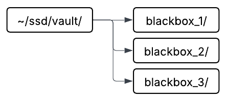

# sonia_blackbox

**sonia_blackbox** is a software tool that records all data traffic from topics defined in the `config/topic_list.yaml`. The purpose of this project is to be able to recover data in order to analyze the prototype's performance after any operation. This includes data from all the sensors (DVL, depth, IMU) and other necessary components.\
The project uses **ROS2** rosbag tool for its recordings of the system and stores them in the directory `~/ssd/vault/` as showcased on the image. the order of reordings go from 1 to a defined maximum of recordings the blackbox will keep with the first being the most recent recording. 

<div align="center">
  
</div>   

---

## Dependencies

### ROS 2 Distro

* Humble

### ROS 2 Packages

* `ament_cmake`
* `rclcpp`
* `std_msgs`
* `std_srvs`
* `sensor_msgs`

### Sonia packages

* `sonia_common_ros2`

---

## Node

* Name: `provider_blackbox`

---

## Registered Topics / Services / Actions

| Type       | Name                          | Direction      | Message/Service Type                     | Description                          |
| ---------- | ----------------------------- | -------------- | ---------------------------------------- | ------------------------------------ |
| Topic      | `/system_monitor/node_status` | Published      | `sonia_common_ros2/msg/NodeStatus`       | Message contains information of the state of a node |

---
## Build Instructions
To build the project, the following commands should be run directly from your ROS2 workspace.

```bash
colcon build --packages-select sonia_blackbox--symlink-install
source install/setup.bash
```
---

## Launch Instructions

### Default launch

```bash
ros2 launch sonia_blackbox launch.py
```

---

## Useful ROS 2 Commands

```bash
ros2 node list
ros2 node info /provider_blackbox
ros2 param list /provider_blackbox
```

---

## References

* [sonia_common_ros2](https://github.com/sonia-auv/sonia_common_ros2)

---